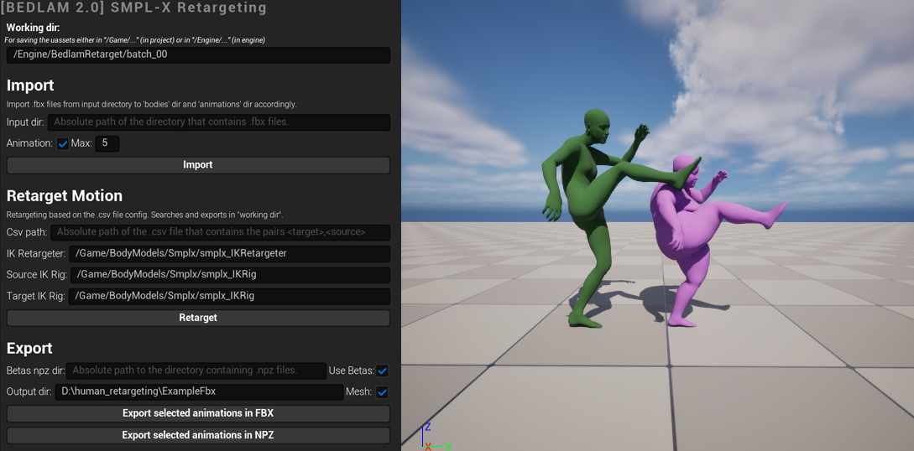

# Retargeting for BEDLAM 2.0

Retargeting transfers motion from one skeleton to another, enabling the augmentation of SMPL-X data with various body
shapes while preserving motion quality.

This repository contains the retargeting tool developed
for [BEDLAM 2.0 NeurIPS 2025](https://bedlam2.is.tuebingen.mpg.de/), built
on [Unreal Engine's IK Retargeter](https://dev.epicgames.com/documentation/en-us/unreal-engine/ik-rig-animation-retargeting-in-unreal-engine?application_version=5.3)
by Epic Games.

We provide two branches: `5.3` and `5.4`.

Switch to the desired branch based on your Unreal Engine version: `git checkout 5.3  # or 5.4`

For the latest UE retargeting features, visit
the [Unreal Engine documentation](https://dev.epicgames.com/documentation/en-us/unreal-engine/ik-rig-animation-retargeting-in-unreal-engine).

For the rendering pipeline of BEDLAM 2.0 and other useful tools, please refer to the [BEDLAM2 Render Tools](https://github.com/PerceivingSystems/bedlam2_render).

## Requirements:

- [Unreal Engine](https://www.unrealengine.com/) 5.3 or 5.4 _(please switch to the desired branch)_
  - Enable Python plugin
  - Enable Python Foundation Packages Plugin (numpy) _(for using .npz files)_
  - Enable Python Remote Execution
- [SMPL-X Blender add-on (20241129 or later)](https://smpl-x.is.tue.mpg.de/) _(for exporting SMPL-X .fbx files from
  .npz files)_
- Python environment with the `requirements.txt` dependencies installed.

## Getting started:

1. Open the project in Unreal Engine.
2. Enable the widget: Right-Click on the `Widgets/HumanEngineWidget` and select `Run Editor Utility Widget`.
3. Edit the `paths.json` file to set your own paths.



## Retargeting Pipeline in 5 steps:

### Step 1: Dataset preparation (FBX files and CSV file)

Use the [SMPL-X Blender add-on (20241129 or later)](https://smpl-x.is.tue.mpg.de/) to export the SMPL-X `.fbx` files from the `.npz` files.

#### Prepare two FBX directories:
- `animations` directory with `.fbx` files (source animations).
- `bodies` directory with `.fbx` and corresponding `.npz` files (target bodies).

For converting to `.fbx` files, use the following script, or the [BEDLAM2 Render Tools (smplx_anim_to_fbx)](https://github.com/PerceivingSystems/bedlam2_render/tree/main/blender/smplx_anim_to_fbx) code.
```bash
# Make source animation FBX files from NPZ files (animations dir)
python make_fbx_files.py --input_dir <input_npz_dir> --output_dir <output_fbx_dir>
# Make target bodies FBX files from NPZ files (bodies dir)
python make_fbx_files.py --input_dir <input_npz_dir> --output_dir <output_fbx_dir> --tpose
```

Exported `.fbx` files structure example:

```
fbx/
    animations/
        it_4027_XL_2000.fbx
        it_4034_L_2000.fbx
        ...
    bodies/
        it_4009_M.fbx
        it_4009_M.npz
        it_4027_XL.fbx
        it_4027_XL.npz
        ...
```

#### Prepare the CSV file with the pairs (see [sample.csv](sample.csv)):

```bash
python make_csv_file.py --bodies-dir <bodies_fbx_dir> --animations-dir <animations_fbx_dir> --output <output_csv_file>
```

### Step 2: Import FBX files to Unreal Engine

For faster importing of the `.fbx` files, use `import_batch.py` script.

Use `--animation` flag to import the animations.

```bash
cd retargeting\Content\Python
# Example of --num_batches 10 --processes 5: Splits the data into 10 batches. It will spawn 5 Unreal Engine at the same time to process the batches.
# (use UE paths: either \Game or \Engine) --output_dir: \Engine\BedlamRetarget\b2_testing_tool
python import_batch.py --input_dir <input_dir_of_fbx_files> --output_dir <output_abs_dir_of_uassets> --num_batches 10 --processes 5
```

Or use the GUI widget. Click on `Import` button and set the Animation toggle button, to import FBX files from an _absolute path directory_:

- check `Animation` (boolean) to import the animation as well -> saves in `{working_dir}/animations/`.
- uncheck `Animation` (boolean) to import the skeleton only -> saves in `{working_dir}/bodies/`.

Imported `.uasset` files structure example:

```
working_dir/
    animations/
        it_4027_XL_2000/
            it_4009_M_2000.uasset
            it_4009_M_2000_Anim.uasset
            it_4009_M_2000_Skeleton.uasset
        ...
    bodies/
        it_4009_M/
            it_4009_M.uasset 
            it_4009_M_Skeleton.uasset
        ...
```

#### Make sure all animations and skeletal meshes are on the floor level


#### Keep IK disabled in the IK-Retargeter


#### Use a SMPL-X IK Rig

We provide an example `SMPL-X IK Rig` (credits: **Joachim Tesch**).

You may use your own IK Rig as well. If the source and target skeletons have different chain names, they must be mapped
in the IK Retargeter.


### Step 3: Retarget animations to target bodies

#### Retargeting with multiple processes (recommended)

Use the `retarget_batch.py` script to retarget animations with multiple processes in batches.

```bash
 python .\retarget_batch.py \
 --pool_dir <working dir> \  # e.g. /Engine/BedlamRetarget/batch_00
 --csv_path_retargeting <csv_file_path> \
 --num_batches 100 \
 --processes 10
```

Or Click the `Retarget` from the GUI widget.

It saves in `{working_dir}/retargeting/`.

Find the **retargeted animations** (Animation Sequences) in the following structure:

```working_dir/
    animations/
        ...
    bodies/
        ...
    retargeting/
        <csv_filename>/
            it_4009_M+it_4009_M_2000_Anim.uasset
            it_4009_M+it_4027_XL_2000_Anim.uasset
            it_4027_XL+it_4039_L_2001_Anim.uasset
            ...
        ...
```
### Step 4: Export the retarget result in FBX and NPZ files

After retargeting, select the Animation Sequences (retargeted animations) to export.
We can export as `.fbx` files (with or without mesh) and/or `.npz` (SMPL-X params, with or without betas), using the GUI widget.

### Step 5: Adjust floor height

After retargeting and exporting, you should adjust the floor height of the exported `.npz` files to ensure the characters are correctly positioned on the ground.


```bash
# The updated .npz files are saved in "{input_dir}_floor_adjusted"
python adjust_floor_npz.py --input_dir <input_npz_dir>
```

For this method, the `SMPLX_NEUTRAL.npz` file is required in `body_models` directory.

Download the SMPL-X with removed head bun models from https://smpl-x.is.tue.mpg.de/download.php

## Visualize in Blender

Contents of exported `.npz` files:

| key              | description                 |
|------------------|-----------------------------|
| gender           | neutral                     |
| mocap_frame_rate | 30.0                        |
| betas            | loaded back from npz file   |
| poses            | (frames, 165)               |
| trans            | (frames, 3)                 |

We can visualize the `.npz` files in Blender using the `SMPL-X` Blender Plugin.
